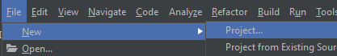
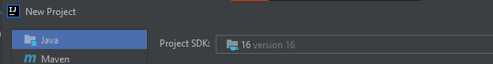
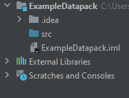
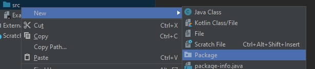
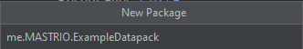
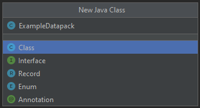
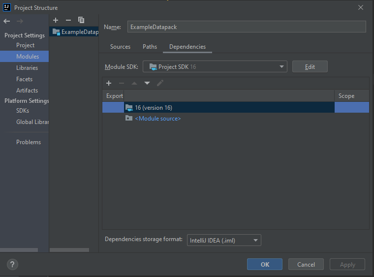
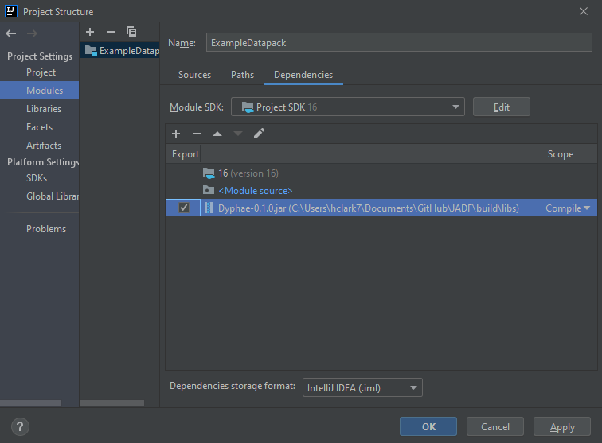
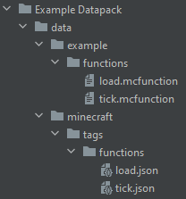

# Getting started
How to make your very own datapack with the Dyphae framework!
<br>

## Installation
To install the framework all you need to do is head over to the [releases](https://github.com/Dyphae/Dyphae/releases) section of the [Github repo](https://github.com/Dyphae/Dyphae) and download the latest release (.jar file)

Once you've done that, volia, you've got the framework.

## Setup a project
You can use any IDE/Code Editor, however it is recommended that you use eith [Intellij](https://www.jetbrains.com/idea/) or [Eclipse](https://www.eclipse.org/ide/).

For this turorial I will be useing [Intellij](https://www.jetbrains.com/idea/) ~~because I like it better~~.

The first thing you want to do is create a new Java project.



Make sure to pick a Java project and set the JDK to 16 *(If you don't have JDK 16 installed, go do that now)*, then click next.



In the next window don't choose a template, just click next.
Then give your project a name , I'll be calling mine **ExampleDatapack**, choose where to save it, and click next.
Now open the newly created project and wait for it to load.

Your sidebar should now look something like this.



Next you want to right click the `src` folder in the sidebar, hover over new, and click on **Package**.



Give your Package a name, in Java packages follow a naming convention where you put your website (eg. com.github) if you have one and then the name of your package. If you don't have a website you just use **me.YOUR_NAME.PACKAGE_NAME**.
I'm going to call my package **me.MASTRIO.ExampleDatapack**.



Now right click your newly created package, hover over new, and create a new Java Class.
Call this class the name of your datapack, I'll call mine ExampleDatapack.



In the class you just created make your **main method**. It should now look like this.

```Java
package me.MASTRIO.ExampleDatapack;

public class ExampleDatapack {

  public static void main(String[] args) {
    
  }

}
```

Now we're going to need to import the framework itself.

Go to *File > Project Structure > Modules* then click on Dependencies.
You should now see something like this.



In the dependencies section click on the **+** button and then *Jars or Directories*.
Navigate to where you downloaded the framework in the [installation section](#Installation) and open it, tick the checkbox for the framework in the dependencies section and click apply then ok.



Now go back to your class with the **main method** and add `extends Datapack` after the name of the class, this tells your code that your making a datapack.

Finally, your code should look something like this:
```Java
package me.MASTRIO.ExampleDatapack;

public class ExampleDatapack extends Datapack {

  public static void main(String[] args) {
    
  }

}
```

Your now ready to make your first datpack using **Dyphae**!

## Creating your first datapack
Time to make your first datapck using **Dyphae**!

*woo, exiting...*

You should have already setup the project, if you havn't go to [Setup a project](#Setup_a_project) and do it now

Go to the class file that we setup in the previous section and above the **main method** write `static Datapack datapack = new YOUR_CLASS_NAME();`.
Make sure you replace *YOUR_CLASS_NAME* with the name of your class, mine will say `static Datapack datapack = new ExampleDatapack();`.
Once you've done this you'll need to hover your mouse over **Datapack** and press *alt + enter* to import the class.

Inside the **main method** you'll need to call a method **init** however you do not do this how you normally would.
You write it like this:
```Java
init(
  DATAPACK_NAME,
  NAMESPACE,
  DESCRIPTION,
  AUTHOR,
  VERSION
);
```
Make sure to replace DATAPACK_NAME, NAMESPACE, DESCRIPTION, AUTHOR, VERSION, with your own.
Mine looks like this:
```Java
init(
  "Example Datapack",
  "example",
  "An example datapack",
  "MASTRIO",
  "1.0.0"
);
```
This initialises your datapack, the name of the datapack will be the name of the folder created, the description is the description of the datapack, the namespace is your datapacks namespace (`namespace:load` etc.)

Your code should now look something like this:
```Java
package me.MASTRIO.ExampleDatapack;

import com.github.MASTRIO.Dyphae.Core.Datapack;

public class ExampleDatapack extends Datapack {

  static Datapack datapack = new ExampleDatapack();

  public static void main(String[] args) {

    init(
      "Example Datapack",
      "example",
      "An example datapack",
      "MASTRIO",
      "1.0.0"
    );

  }

}
```

Now it's time to declare our **load** and **tick** functions!

After your `init()` declaration add in,
```Java
load = new String[] {
  Command.say("I am loaded, very pog")
};
tick = new String[] {
  Command.say("tick tock")
};
```
This is where you put the commands that will be in your **load** and **tick** functions, as you can see inside of these I've put in a command, the say command.

In **Dyphae** you don't use commands how you normally would in a datapack, you **call methods and use different arguments** to customise them.
For the */say* command the only argument is the message you want to send to the chat, so that is what I've put in my method call, you can replace this message with whatever you want, or add in as many commands as you wish, it doesn't matter.

Your code should now look something like this:
```Java
package me.MASTRIO.ExampleDatapack;

import com.github.MASTRIO.Dyphae.Command;
import com.github.MASTRIO.Dyphae.Core.Datapack;

public class ExampleDatapack extends Datapack {

  static Datapack datapack = new ExampleDatapack();

  public static void main(String[] args) {

    init(
      "Example Datapack",
      "example",
      "An example datapack",
      "MASTRIO",
      "1.0.0"
    );

    load = new String[] {
      Command.say("I am loaded, very pog")
    };
    tick = new String[] {
      Command.say("tick tock")
    };

  }

}
```
Now after the **load** and **tick** functions, write `datapack.build();`.

Once you've done this you can run your code and you should see a console output similar to the one below and your datapack should get built!
```
    ___  ________  ________  ________ 
   |\  \|\   __  \|\   ___ \|\  _____\
   \ \  \ \  \|\  \ \  \_|\ \ \  \__/ 
 __ \ \  \ \   __  \ \  \ \\ \ \   __\
|\  \\_\  \ \  \ \  \ \  \_\\ \ \  \_|
\ \________\ \__\ \__\ \_______\ \__\ 
 \|________|\|__|\|__|\|_______|\|__| 
[Dyphae@Info]: Building 'Example Datapack' version '1.0.0' by 'MASTRIO'
~----------------------------------------------------------------------------------------~
[Dyphae@Log]: Generated base folder
[Dyphae@Log]: Generated data folder
[Dyphae@Log]: Generated pack.mcmeta file
[Dyphae@Log]: Generated minecraft folder
[Dyphae@Log]: Generated tags folder
[Dyphae@Log]: Generated tags/functions folder
[Dyphae@Log]: Generated load.json file
[Dyphae@Log]: Generated tick.json file
[Dyphae@Log]: Generated example folder
[Dyphae@Log]: Generated functions folder
[Dyphae@Log]: Generated tick.mcfunction file
[Dyphae@Log]: Generated load.mcfunction file
[Dyphae@Info]: This method runs when the datapack is being built
[Dyphae@Info]: You put your mcfunction declarations here
~----------------------------------------------------------------------------------------~
[Dyphae@Success]: Datapack Build Completed
[Dyphae@Info]: The built datapack is located at: C:\Users\hclark7\Documents\GitHub\ExampleDatapack/Example Datapack/
```
And your datapack should be something like this:



<br>
<br>
Now we get to the most fun part, creating functions!

Outside of your **main method** create a new method called **onBuild** like the one below,
```Java
@Override
public void onBuild() {
    
}
```
Anything inside this method gets run when the datapack is built, so this is where we declare our functions

!> **Note:** <br>
You can also take advantage of **Dyphae**'s **CommandLogger** class to send out info to the console when the datapack is being built <br><br>
(eg. ConsoleLogger.info("This functions is sus") or ConsoleLogger.warn("Why didn't I delete this code?") )

Now we need to make a function. You can do this using this code:
```Java
@MCFunction
Function testFunction = new Function("test_function").setCommands(new String[] {
  Command.say("I am a test"),
  Command.give("@a", "minecraft:diamond", 1)
}).init();
```
Now this is a *little* complicated so let me take you through the code <br>
*'clears throat'*

`@MCFunction` <br>
This **annotation** acts simply as a marker to remind you that's a function. The **MCFunction** annotation also supports some parameters such as:
- name (Name of function, eg. Super cool function!!!, etc.)
- description (A short description of the function to remind you of what it does)
- author (For if you have multiple people coding the datapack, so you know who made what function)
- notes (Notes about the function to remind you about something... idk)
- depricated (Reminds you of wether the function is depricated and will be removed in the next release)

This annotation is completly optional, but I highly recommend using it to keep track of your functions

`Function testFunction = new Function("test_function")` <br>
This bit of code creates a new **Function** object called testFunction and gives it the name *test_function*.
This just tells the compiler that you made a new function called *test_function*, you can call it whatever you want.

```Java
.setCommands(new String[] {
  Command.say("I am a test"),
  Command.give("@a", "minecraft:diamond", 1)
})
```
This bit of code is attatched to the previous code and is where you declare all of the commands in the function.
This function says *I am a test* and then gives all players a diamond when it's run.

`.init();` <br>
This bit of code is attatched to the previous bit of code and tells the compiler to create the function.
Without it the function will not be created when you build the datapack.
<br>
<br>
<br>

And now finally, your code should look something like this:
```Java
package me.MASTRIO.ExampleDatapack;

import com.github.MASTRIO.Dyphae.Command;
import com.github.MASTRIO.Dyphae.Core.Datapack;
import com.github.MASTRIO.Dyphae.Core.Function;
import com.github.MASTRIO.Dyphae.Core.MCFunction;

public class ExampleDatapack extends Datapack {

  static Datapack datapack = new ExampleDatapack();

  public static void main(String[] args) {

    init(
      "Example Datapack",
      "example",
      "An example datapack",
      "MASTRIO",
      "1.0.0"
    );

    load = new String[] {
      Command.say("I am loaded, very pog")
    };
    tick = new String[] {
      Command.say("tick tock")
    };

    datapack.build();

  }

  @Override
  public void onBuild() {

    @MCFunction
    Function testFunction = new Function("test_function").setCommands(new String[] {
      Command.say("I am a test"),
      Command.give("@a", "minecraft:diamond", 1)
    }).init();

  }

}
```

<br>
<br>

Congratulations! You've succesfully made your very own datapack using **Dyphae**! <br>
~~Now go make some magic!~~

<br>
<br>
<br>

***Documentation generated using [Docsify](https://docsify.js.org/#/)***